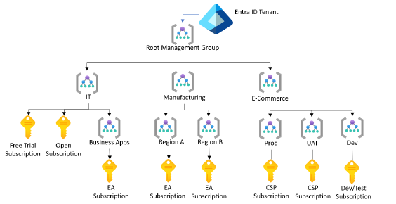

# AZ-900 Azure Fundamentals Study Guide

---

## CapEx, OpEx and Consumption-based

### OpEx  
- No upfront cost, pay-as-you-go.  
- Examples: Electricity, subscription  

### CapEx  
- One-time, upfront expense  
- Examples: Constructing an IT building, land, equipment  

---

## Benefits of High Availability and Scalability in the Cloud

### High Availability (HA)  
- **Definition:** Ensures applications and services are continuously operational with minimal downtime.  
- **Goal:** Reduce single points of failure.  
- **Methods:**  
  - Redundant hardware/VMs  
  - Load balancing  
  - Azure Availability Zones and Sets  

### Fault Tolerance  
- **Definition:** The ability of a system to continue operating properly in the event of a component failure.  
- **Key Concept:** No service interruption despite hardware/software failures.  
- **Examples in Azure:**  
  - Geo-redundant storage (GRS)  
  - Azure Load Balancer with backend redundancy  

### Disaster Recovery (DR)  
- **Definition:** Strategies and services for restoring operations after a major failure (e.g., natural disaster, cyberattack).  
- **Focus:** Backup, restore, and failover.  
- **Azure Services:**  
  - Azure Site Recovery (ASR)  
  - Azure Backup  
- **RTO:** Max acceptable downtime  
- **RPO:** How much data loss is acceptable  

### Scalability  
- **Definition:** The ability to increase or decrease resources based on demand.  
- **Types:**  
  - Vertical (scale up): Add more power (CPU, RAM) to a single machine.  
  - Horizontal (scale out): Add more machines or instances.  
- **Azure Example:** Azure App Service auto-scaling  

### Elasticity  
- **Definition:** Automatic scaling of resources based on real-time demand (dynamically).  
- **Dynamic:** Grows and shrinks without manual intervention.  
- **Example:** Automatically add more VMs during high traffic, then remove them afterward.  

### Agility (fast and flexible)  
- Ability to quickly deploy and change resources to meet new business needs or changes.  
- **Benefits:**  
  - Faster time to market  
  - Easier experimentation and innovation  
- **Azure Example:** Use of DevOps and ARM templates to deploy resources quickly  

---

## Differences Between Cloud Service Categories  

| Component         | On-prem | IaaS     | PaaS          | SaaS                  |
|-------------------|---------|----------|---------------|-----------------------|
| Customer manage   | Yes     | Yes      | Partial       | No                    |
| Cloud provider manage | No  | Partial  | Yes           | Yes                   |
| Data              | Yes     | Yes      | Yes           | Yes                   |
| Application       | Yes     | Yes      | Yes           | No                    |
| Runtime           | Yes     | Yes      | Yes           | No                    |
| OS                | Yes     | Yes      | No            | No                    |
| Hypervisor / VM   | Yes     | Yes      | No            | No                    |
| Compute           | Yes     | Yes      | No            | No                    |
| Network           | Yes     | Yes      | No            | No                    |
| Storage           | Yes     | Yes      | No            | No                    |

---

## Cloud Service Models

### Infrastructure as a Service (IaaS)  
- Examples:  
  - Azure VM  
  - Azure Storage  
  - Azure Networking  

### Platform as a Service (PaaS)  
- Examples:  
  - Azure App Service  
  - Azure SQL Database  
  - Cosmos DB  
  - Azure Files  
  - Azure Active Directory Domain Services  

### Software as a Service (SaaS)  
- Examples:  
  - Microsoft Teams  
  - Microsoft Exchange Online  
  - Microsoft SharePoint Online  
  - Microsoft OneDrive  
  - Microsoft Dynamics 365  

---

## Serverless (FaaS)  

- **Function as a Service**  
- No server management — Azure handles infrastructure.  
- Event-driven — Code runs in response to events (HTTP requests, timers).  
- Auto-scaling — Scales automatically based on demand.  
- Pay-per-use — You only pay for execution time (not idle time).  
- Faster development — Focus on writing code, not managing servers.  

### Azure Serverless Services

| Service          | Purpose                          |
|------------------|---------------------------------|
| Azure Functions  | Run event-triggered code (micro tasks) |
| Logic Apps       | Automate workflows without coding |
| Event Grid       | Event routing between services  |

---

## Types of Cloud Computing

| Type         | Description                                                             |
|--------------|-------------------------------------------------------------------------|
| Public       | Limitless, many regions, many services                                  |
| Private      | Azure Stack, Azure Arc                                                  |
| Hybrid       | Combination of public and private clouds                                |
| Community    | Shared by organizations with common concerns                           |

---

## Azure Stack (Hybrid Cloud)

- Extends Azure services to on-premises or edge.  
- Used for disconnected, low-latency, or regulated environments.  

### Azure Stack Products

| Product             | Description                                  |
|---------------------|----------------------------------------------|
| Azure Stack Hub     | Full Azure services on-premises               |
| Azure Stack HCI     | Run VMs on hyperconverged systems             |
| Azure Stack Edge    | Edge device with local compute + ML           |

---

## Azure Arc (Multi-Cloud Management)

- Manage on-premises, multi-cloud, and edge resources from Azure.  
- Supports Windows/Linux servers, Kubernetes, SQL, etc.  
- Brings Azure security, policies, and monitoring to non-Azure systems.  

---

## Reliability and Predictability

- Azure healing, storage with 3 copies, auto-scale, SLA, design for failure, monitor.  
- Predictability through SKU (VM, storage), ACU (Azure compute unit), behavior, templates, automation, and DevOps.  

---

## Uses of Regions and Region Pairs

- **Regions:** Geographic area containing one or more datacenters (e.g., East US, West Europe).  
- **Sovereign clouds:** Separate Azure environments for specific countries to meet legal requirements (Azure Government, Azure China, Azure Germany).  
- **Multiple regions:** Improve high availability, disaster recovery, geo-redundancy (e.g., host app in East US and backup in West US).  

---

## Benefits and Usage of Resource Groups

- Logical containers for related Azure resources.  
- Resources in a group can be managed collectively, can span multiple regions, and support tagging for cost and management.  

---

## Physical Data Centers

- Secure buildings hosting Azure’s physical hardware (compute, storage, networking).  
- Features: Independent power supply, redundant cooling, physical and logical security, designed for high availability and fault tolerance.  

---

## Edge Locations

- Entry/exit points for traffic in Microsoft global network.  
- Placed near users for better latency and fewer network hops.  
- Provide edge compute capabilities for faster data processing.  

---

## Microsoft Global Network

- One of the largest private WANs globally.  
- Connects physical data centers, edge locations, regional gateways.  
- Designed for high performance, reliability, low latency.  

---

## ExpressRoute

- Creates private connections from on-premises to Azure bypassing the public internet.  
- Uses MPLS WAN to connect via peering locations.  
- Offers low-latency, high-throughput, reliable connections.  

---

## Azure Edge Zones

- Extension of Azure to the network edge for low latency and real-time apps.  
- Types: Azure Edge Zones, Edge Zones with Carriers, Private Edge Zones.  

---

## Availability Zone

- Physically separate resources within the same Azure region.  

  
   
  <em>Availability Zone - image</em>

---

## Availability Sets

- Group of VMs spread across fault domains and update domains to protect against hardware failures and planned maintenance.  
- Ensures at least one VM remains available during failures/updates.  

  
   
  <em>Availability Set - image</em>

---

## Zonal and Zone-Redundant Services

- **Zonal:** Resource placed in a specific availability zone.  
- **Zone-redundant:** Resource replicated across multiple availability zones for high resilience (e.g., Zone-Redundant Storage, Zone-Redundant SQL DB).  

---

## Non-Regional Services

- Services not tied to specific Azure regions and run on global infrastructure.  
- Examples: Azure Active Directory, Azure DNS, Content Delivery Network (CDN), Microsoft Entra ID, Traffic Manager.  

---

## Fault Domains and Update Domains

- **Fault domains:** Group of hardware sharing power/network to isolate failures.  

  
   
  <em>Fault Domain - image</em>

- **Update domains:** Groups of resources updated/maintained at the same time to stagger updates and reduce downtime.  

  
   
  <em>Update Domain - image</em>

---

## Proximity Placement Groups (PPGs)

- Reduce latency by placing Azure compute resources physically close within the same data center.  
- Useful for high-performance workloads (HPC, databases).  

---

## Azure Management Hierarchy

| Level               | Description                                    |
|---------------------|------------------------------------------------|
| Management Group    | Highest scope, groups multiple subscriptions  |
| Subscription       | Logical billing unit, contains resource groups|
| Resource Group     | Container for related resources                |
| Resource           | Individual Azure service (VM, Storage, etc.)  |

  
   
  <em>Azure Management - image</em>

  
   
  <em>Entra ID Tenant - image</em>

---

## Azure Resource Manager (ARM)

- Deployment and management service for Azure.  
- Uses JSON ARM templates for infrastructure as code (IaC).  
- Supports RBAC and tagging at resource level.  
- Enables grouped resource deployments.  

---

## Azure Container Instances (ACI)

- PaaS for running containers without VM management.  
- Supports Linux and Windows containers.  
- Serverless and billed per second.  
- Use case: Testing, batch jobs, temporary workloads.  

---

## Azure Container Apps (ACA)

- Fully managed serverless platform for microservices and containerized apps.  
- Based on Kubernetes, KEDA, Dapr, Envoy.  

---

## Azure Virtual Desktop Service

*(Description placeholder — add as needed)*  

---

## Azure Network Services

- **Virtual Network (VNet):** Private, isolated network for Azure resources.  
- Supports subnets, NSGs, routing, IP addressing.  

### VNet Peering

- Connects VNets in same or different regions with private traffic via Microsoft backbone.  
- Types: Regional (same region), Global (different regions).  

### VPN Gateway

- Encrypted tunnel over internet for on-prem to Azure or VNet-to-VNet connections.  
- Uses IPSec/IKE protocols.  

### ExpressRoute

- Private, dedicated on-prem to Azure connection.  

---

## Azure DNS

- Hosts DNS zones and manages domain names within Azure infrastructure.  

---

## Storage Services

| Storage Type         | Description                       |
|----------------------|---------------------------------|
| Files                | SMB file shares                 |
| Blob                 | Unstructured data (block, page, append blobs) |
| Table storage        | Non-relational, semi-structured data |
| Queue storage        | Asynchronous message storage    |

---

## Disk Storage Types

| Type          | Description          |
|---------------|----------------------|
| Standard HDD  | Cost-effective, slower|
| Standard SSD  | Better performance    |
| Premium SSD   | High performance      |
| Ultra Disk    | Ultra-low latency     |

---

## Storage Accounts

| Type                     | Supports                           |
|--------------------------|----------------------------------|
| Standard General Purpose v2 | Blobs, file shares, tables, queues |
| Premium Block Blobs       | Block blob and append blob       |
| Premium Page Blobs        | Page blobs only                  |
| Premium File Shares       | File shares only                 |

---

## Storage Tiers

| Tier     | Use Case                 |
|----------|--------------------------|
| Hot      | Frequently accessed data  |
| Cool     | Infrequently accessed data|
| Archive  | Rarely accessed, long-term|

---

## Storage Replication

| Replication Type         | Description                                         |
|-------------------------|-----------------------------------------------------|
| Locally Redundant Storage (LRS) | Copies data 3 times within a single data center |
| Zone Redundant Storage (ZRS)     | Copies data across 3 availability zones       |
| Geo-Redundant Storage (GRS)      | Copies data to a secondary region + LRS primary |
| Geo-Zone-Redundant Storage (GZRS)| Combines ZRS + GRS for highest durability      |

---

## Storage Copying Tools

| Tool             | Description                           |
|------------------|-------------------------------------|
| AzCopy (CLI)     | Transfer data to/from storage account|
| Storage Explorer (GUI) | Manage storage data visually     |
| Azure Migrate    | Discovery, assessment, migration    |
| Databox          | Transfer large data volumes          |
| Azure File Sync  | Hybrid file shares (local & cloud)  |

---

## Data Stores

| Type           | Description                |
|----------------|----------------------------|
| Structured     | Relational data (SQL)      |
| Semi-structured| Key/value pairs (JSON)     |
| Unstructured   | Media files (photos, videos, audio) |
| Streaming      | Continuous data streams    |

---

## Authentication and Authorization

| Term            | Description                         |
|-----------------|-----------------------------------|
| Authentication (AuthN) | Identity verification of person or service |
| Authorization (AuthZ)  | Access level granted to authenticated entity |

---

## Microsoft Entra ID (Previously Azure Active Directory)

- Centralized identity provider and directory service.

  
   
  <em>Entra ID - image</em>

### Licensing

| License        | Features                             |
|----------------|-------------------------------------|
| MS Entra ID P1 | Conditional Access + Single Sign-On (SSO) |
| MS Entra ID P2 | Identity Protection + Privileged Identity Management (PIM) |

### PIM Features

- Just-in-time admin access  
- Role-based access monitoring  

---

## Active Directory (AD) vs Microsoft Entra ID (Azure AD)

| Feature            | Active Directory (AD)            | Microsoft Entra ID (Azure AD)          |
|--------------------|---------------------------------|---------------------------------------|
| Type               | On-prem directory service        | Cloud-based IAM                       |
| Protocols Used     | LDAP, Kerberos                  | HTTPS, SAML, OAuth, OpenID Connect    |
| Device Join       | Domain Join (Windows devices)     | Azure AD Join, Microsoft Entra Join   |
| Application Support | On-prem apps (legacy)             | Cloud apps (M365, SaaS, custom)       |
| Internet Authentication | Not designed for internet/cloud | Built for cloud and internet          |
| Authentication Location | Local domain controller          | Global Microsoft cloud infrastructure |
| Federation/SSO Support | Limited (ADFS required)           | Built-in SSO for cloud & some on-prem  |
| Integration       | On-prem systems                  | Microsoft 365, Azure, Intune, cloud   |
| MFA / Conditional Access | Requires add-ons                | Built-in with P1/P2 license            |

---

## Additional Authentication Concepts

- **SSPR:** Self-service password reset  
- **JIT:** Just-in-time access for new hires/temporary staff  
- **JEA:** Just enough access, principle of least privilege  
- **MFA Principles:**  
  - Knowledge (password, PIN)  
  - Possession (token, phone code)  
  - Inherent (fingerprint)  
  - Conditional  

---

## Passwordless Authentication

- Windows Hello for Business  
- Microsoft Authenticator  
- FIDO2 Security Keys  

---

## IAM and RBAC Roles

| Role        | Permissions                        |
|-------------|----------------------------------|
| Owner       | Full access                      |
| Contributor | Can create/manage but not assign access |
| Reader      | View-only access                 |

---

## Azure Security

- Defense in Depth (DiD)  
- Microsoft Defender for Cloud (CSPM and CWPP)  
- Microsoft Sentinel (SIEM + SOAR)  

---

## Azure Cost Management

- Cost analysis, alerts, budgeting  
- Billing and invoice management  

### Tools

- Azure Pricing Calculator  
- Total Cost of Ownership (TCO) Calculator  

---

## Azure Governance and Compliance

### Microsoft Purview

- Unified data governance and compliance  
- Classification, catalog, sensitive data management  
- Supports GDPR, HIPAA, multi-cloud  

### Azure Policy

- Enforce rules on Azure resources  
- Automatically audit, allow, or deny configurations  

### Resource Locks

- Prevent accidental deletion/modification  
- Types: ReadOnly and Delete  

### Tags

- Metadata key-value pairs for organizing resources  
- Useful for cost, automation, reporting  

---

## Azure Service Lifecycle

| Stage            | Description                        |
|------------------|----------------------------------|
| Development      | Internal, not public              |
| Private Preview | Invite-only testing               |
| Public Preview  | Open testing, no SLA              |
| General Availability (GA) | Fully supported, SLA-backed |

---

## Microsoft Trusted Cloud Principles

- Security, Privacy, Compliance, Transparency, Reliability  

### Microsoft Trust Center

- Portal for security, privacy, compliance resources  
- Audit reports, certifications, policies  

---

## Azure Resource Deployment and Management

- Azure Portal (GUI)  
- Azure Cloud Shell (CLI, PowerShell)  
- Azure Arc (Hybrid management)  
- ARM Templates (JSON, IaC)  

---

## Azure Monitoring and Tools

| Tool             | Purpose                                  |
|------------------|------------------------------------------|
| Azure Advisor    | Best practice recommendations            |
| Azure Monitor   | Collect/analyze telemetry data             |
| Azure Service Health | Real-time alerts for Azure service issues |

---

## Azure AD Identity Protection

- Detects/responds to risky users/sign-ins  
- Risk types: Atypical travel, anonymous IPs, malware-linked login, password spray  
- Policies for risk response and MFA enforcement  

---

## Azure AD Privileged Identity Management (PIM)

- Just-in-time access, approval workflows  
- MFA enforced, time-bound roles  
- Audit logs and access reviews  

---

